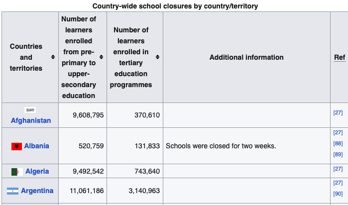

# covid-19 impact-on-education
### wikipedia web scraping

https://en.wikipedia.org/wiki/Impact_of_the_COVID-19_pandemic_on_education

<h2>Introduction</h2>
This project involves the use of Python's libraries to extract information from Wikipedia about the impact of Covid-19 on education. After investigating the site some insights and categorisations can be made.
   

<h2>Scenario</h2>
Covid-19 has affected society in many different ways...
" The COVID-19 pandemic affected educational systems across the world.[1] The number of cases of COVID-19 started to rise in March 2020 and many educational institutions and universities underwent closure. Most countries decided to temporarily close educational institutions in order to reduce the spread of COVID-19. UNESCO estimates that at the height of the closures in April 2020, national educational shutdowns affected nearly 1.6 billion students in 200 countries: 94% of the student population and one-fifth of the global population. "

<h2>Data collection</h2>
To gather the data, I used Python's intuitive web scraping library, 'BeautifulSoup' to send a request to the website host. Inspecting the site reveals some details to pick the specific data needed; the HTML class 'wikitable sortable' is its implementation. For pulling columns and rows the library provides a parser which looks for the relevant HTML tags, 'th' and 'tr' respectively. 
 
 

In the screenshot above, the code implementation can be observed. The code imports the 'Request' and 'BeautifulSoup', libraries which are used to get a response from the website host and to pull data under the specified HTML class table. Using the 'th' and 'tr' tags which specify columns and rows in markup language, 'BeautifulSoup' is able to find data from specific tables. In this code snippet, the 'table[0]' value represents the first table, 'Country-wide school closures by country/territory'.

<h2>Data transformation</h2>
After the table had been saved as a csv file, there were several columns containg null values. Using the 'Pandas' library, I conducted some cleaning and transformation to prepare it for succinct exploratory analysis. After reading the csv file into a 'Pandas' frame, I checked for null values as first inspection revealed some mostly empty columns. Some columns contain multiple data types as well which is as a consquence of parsing markup language on Wikipedia into a readable form.

First table can be seen containing five columns, 'Country or territories', 'Number of formal', 'Additional Information', 'Ref']
