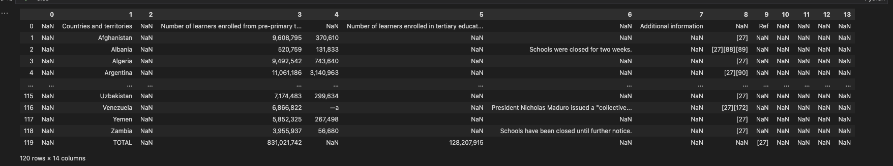
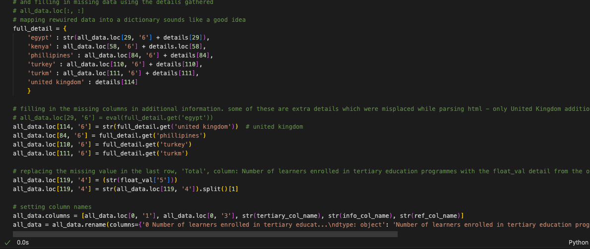
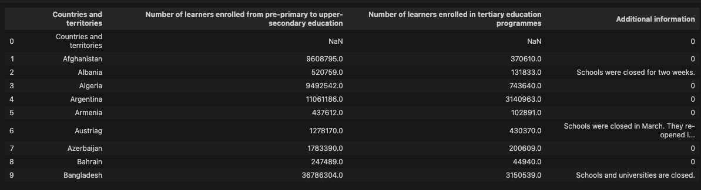
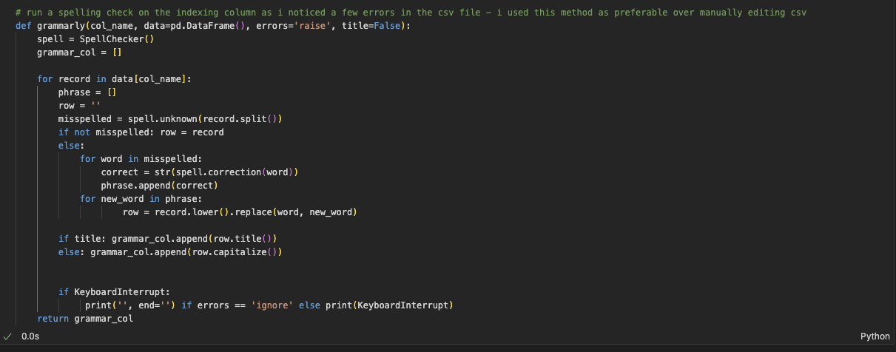

# covid-19 impact-on-education
### gathering, transformation and exploratory analysis
https://en.wikipedia.org/wiki/Impact_of_the_COVID-19_pandemic_on_education

<h2>Introduction</h2>

In this project, I use Python's libraries to extract information from Wikipedia about the impact of Covid-19 on education. This data may be relevant for ingestion into a database with the right data transformation based on well-defined requirements. In this project, I have created a database with tables suitable for easy referencing or legibility and one for running SQL queries effectively. 

<h2>Scenario</h2>

Covid-19 has affected society in many different ways... 
The pandemic has had various impacts on our society; enrollment in educational institutions across populous nations and details about the duration provided may reveal differing attitudes. 

From wikipedia: " The COVID-19 pandemic affected educational systems across the world.[1] The number of cases of COVID-19 started to rise in March 2020 and many educational institutions and universities underwent closure. Most countries decided to temporarily close educational institutions to reduce the spread of COVID-19. UNESCO estimates that at the height of the closures in April 2020, national educational shutdowns affected nearly 1.6 billion students in 200 countries: 94% of the student population and one-fifth of the global population. "

<h2>Data collection</h2>

To gather the data, I used Python's intuitive web scraping library, 'BeautifulSoup' to send a request to the website host. Inspecting the site reveals some details to pick the specific data needed; the HTML class 'wikitable sortable' is its implementation. For pulling columns and rows the library provides a parser which looks for the relevant HTML tags, 'th' and 'tr' respectively. 

In the screenshot above, the code implementation can be observed. The code imports the 'Request' and 'BeautifulSoup', libraries which are used to get a response from the website host and to pull data under the specified HTML class table. Using the 'th' and 'tr' tags which specify columns and rows in HTML (hypertext markup language), 'BeautifulSoup' can find data from specific tables. In this code snippet, the 'table[0]' value represents the first table, 'Country-wide school closures by country/territory'. 

<h2>Data transformation</h2>

After the table as a CSV file, several columns contained null values. Using 'Pandas', 
After reading the CSV file into a 'Pandas' frame, I checked for null values as the first inspection revealed some mostly empty columns; some columns in the raw data contain multiple data types. These inconsistencies can occur when gathering data so transformation is empirical. 
The table contains five columns, 'Country or territories', 'Number of learners enrolled from pre-primary to upper-secondary education', 'Number of learners enrolled in tertiary education programmes', 'Additional Information ' and 'Ref']

There are three main problems with the data gathered from the internet. Not all the data is under the correct field names, null values are present in multiple columns and spelling errors in the first column containing the names of relevant countries or territories. Null columns are unneeded, however, upon investigating each null column since some contain column names and potentially more misplaced data. To improve usability, it is good to make these changes.

<ol type="a">
  <li>Data in wrong columns can be noticed starting with field names in the first record, index 0.</li>
  <li>Null columns contain misplaced values that may be part of the table. </li>
  <li>The first column can serve as a primary identifier, however it contains spelling errors.</li>
</ol>
 
This screenshot shows the code responsible for extracting non-null values from the raw data being transformed. 

transformed data 

In this shot, all columns contain appropriate, accurate data. All missing information can be found in the comma-separated values file or unavoidable errors from data gathering. Easy to perform sorting and indexing 

Created a grammar function seen here which checks for grammatical errors using the SpellChecker Python module to make corrections on wrongly spelt words firstly in the 'Countries and Territories' column. It can be seen in a shot above, 'Austriag' which should be 'Austria.' This error inspired this function since correcting errors in a CSV file can be very timely. After running this function on ['Countries and territories' and 'Additional information'], I can be sure each word is spelt correctly in the transformed data.

<h6> Checking spelling  </h6>

<h4> Extract, transform, load </h4>

Now with an idea of the final data, I atarted thinking of use cases such as ingestion into a database. I decided to create two CSV files, one with comma formatting for the numbers as they are hard to identify at first glance. The second file contains purely numeric data which is stored as numeric data types instead of 'string' or characters as in the other file. 

Converted to floating point numerical values where it was relevant. To do so it was a simple matter of changing the characters using the 'Numpy' Python library. With this result, it is much easier to sort by those numeric data points, namely, 'Number of learners enrolled in primary and secondary education programmes' and 'Number of learners enrolled in tertiary education programmes.' Then in the next rotation, I decided to perform some simple distribution analysis. To analyse the significance of these numbers, I think I could collect some data on the populations of these nations. I thought to use a percentile calculator to find the nations which are above or at the 75th quartile.

<h4>Reflective </h4>
It may be useful to add this data to a database as part of record keeping and for efficient access. To do this, SQL has various data control languages to create, model and query databases so I created a local server using a Microsoft SQL Server container installed in an isolated environment via an application called 'Docker'.
One csv file contains comma formatting for numeric values which makes it easy to read the information and . This file I named 'Ingest.db' and the other

